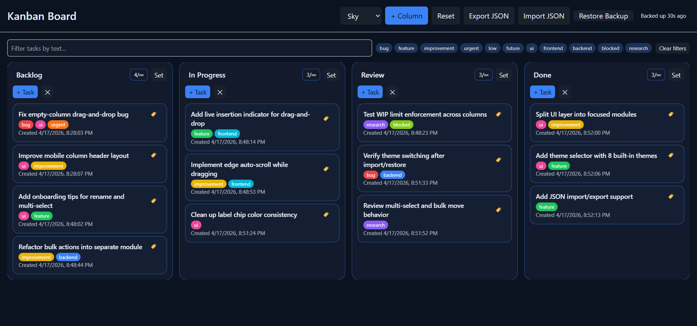

# TypeScript Kanban Board

A fully interactive **Kanban workflow board** built with **strict TypeScript**, featuring drag-and-drop, multi-select, labels, filters, per-column WIP limits, theming, auto-backup, and JSON import/export.

This project was developed as an **advanced TypeScript capstone**, focused on complex DOM typing, modular architecture, and framework-free UI behavior.

[](https://your-vercel-url.vercel.app)


---

## About

The **TypeScript Kanban Board** is a browser-based productivity app designed to push the limits of TypeScript without relying on frameworks like React or Vue.

This project was built as a capstone-style learning project focused on:

- mastering **TypeScript strict mode**
- building complex DOM interactions with strong typing
- managing real UI state without a frontend framework
- implementing drag & drop, labels, filters, WIP limits, and multi-select behavior
- refactoring a growing codebase into smaller focused modules
- modernizing the workflow with **Vite**

Even though it is framework-free, the board behaves like a small professional web app and demonstrates advanced TypeScript patterns in a real UI.

---

## Features

### Core Kanban Functionality

- Create, rename, and delete columns
- Create, rename, and delete tasks
- Reorder tasks with **native HTML5 drag and drop**
- Move tasks between columns with live drag feedback
- Drop tasks into empty columns
- Responsive board layout with polished visual feedback

### Drag & Drop UX

- Drag between populated columns
- Drag into empty columns
- Live insertion indicator line while dragging
- Full-column highlight during drag-over
- Edge auto-scroll when dragging near the left or right side of the board

### Task Labels (Tags)

- Add and edit labels per task
- Bulk-friendly label editing flow
- Color-coded label chips
- Quick-select common labels
- Support for custom labels
- Consistent color assignment for custom tags

### Filters and Search

- Live text search
- Filter by label
- Clear active filters quickly
- Filtered rendering without mutating real board data

### Multi-Select and Bulk Actions

- **Ctrl/Cmd-click** to multi-select tasks
- **Shift-click** to select task ranges within a column
- Bulk actions bar with:
  - clear selection
  - delete selected tasks
  - move selected tasks to another column
- Visible selected state on task cards
- Lightweight in-app tips for discoverability

### Column WIP Limits

- Per-column WIP limits
- Click the WIP badge to cycle common presets:
  - `∞`
  - `2`
  - `3`
  - `5`
  - `8`
  - `13`
- Shift-click for custom WIP input
- Visual feedback when a column reaches its limit
- Blocked drops when a destination column is already full

### Theme System

Built-in themes include:

- Sky
- Grape
- Slate
- Sunset
- Forest
- Ocean
- Sand
- Rose

Themes persist automatically between sessions and continue working correctly after import/restore flows.

### Persistence, Backup, and Import/Export

- Auto-save with `localStorage`
- Auto-backup support
- Backup status indicator
- Restore from backup
- Export full board state as JSON
- Import JSON in:
  - **Replace mode**
  - **Merge mode**
- Toast notifications for success, info, and error states

---

## Tech Stack

### Core


### Tools


---

## Project Structure

```bash
ts-kanban-board/
│
├── src/
│   ├── app.ts
│   ├── main.ts
│   ├── drag.ts
│   ├── store.ts
│   ├── storage.ts
│   ├── types.ts
│   └── ui/
│       ├── index.ts
│       ├── contracts.ts
│       ├── board-utils.ts
│       ├── render-column.ts
│       ├── render-task.ts
│       ├── selection.ts
│       ├── bulk-actions.ts
│       ├── filters.ts
│       ├── labels.ts
│       ├── theme.ts
│       ├── backup.ts
│       ├── dom.ts
│       └── feedback.ts
│
├── images/
│   ├── board-main.png
│   ├── board-drag.png
│   ├── labels-editor.png
│   ├── filters-active.png
│   ├── bulk-actions.png
│   ├── wip-limit.png
│   └── theme-selector.png
│
├── index.html
├── styles.css
├── package.json
├── tsconfig.json
├── vite.config.ts
├── README.md
├── CHANGELOG.md
├── LICENSE
└── .gitignore
```

---

## Architecture Notes

The UI layer was refactored from a large single-file approach into focused modules so that each feature has a clear responsibility:

- `ui/index.ts` — main UI coordinator, event binding, rendering pipeline
- `ui/render-column.ts` — column rendering and drop-zone behavior
- `ui/render-task.ts` — task card rendering and task interactions
- `ui/selection.ts` — selection logic and multi-select behavior
- `ui/bulk-actions.ts` — bulk delete, move, and bulk action bar updates
- `ui/filters.ts` — filter state and matching logic
- `ui/labels.ts` — label colors, chips, and label UI helpers
- `ui/theme.ts` — theme normalization and theme changes
- `ui/backup.ts` — backup status display helpers
- `ui/board-utils.ts` — task lookup, pointer index helpers, shared UI utilities
- `ui/dom.ts` — DOM query helpers
- `ui/feedback.ts` — toast notifications

This refactor made the project easier to maintain and closer to a production-style structure while staying fully framework-free.

---

## Screenshots

### Main Board UI

The primary board layout with multiple columns, task cards, filters, and the full top toolbar for theme switching, JSON import/export, and backup restore.



### Drag & Drop Task Movement

Dragging a task between columns with live visual feedback.

[Drag & Drop Task Movement](images/board-drag.png)

### Label Editor

Inline label editing with quick-select chips and custom labels.

[Label Editor](images/labels-editor.png)

### Filters Active

Task filtering by text and labels.

[Filters Active](images/filters-active.png)

### Multi-Select + Bulk Actions

Multiple selected tasks with the bulk actions bar visible.

[Multi-Select + Bulk Actions](images/bulk-actions.png)

### WIP Limit Behavior

A column showing WIP controls and limit feedback.

[Column WIP Limit Editing](images/wip-limit.png)

### Theme Selector

Switching between built-in themes.

[Theme Selector](images/theme-selector.png)

---

## Learning Focus

This project helped me practice:

- advanced TypeScript strict mode in a real UI
- stronger domain modeling with branded IDs and typed entities
- DOM querying and event handling with type safety
- HTML5 drag-and-drop with typed payload helpers
- modular architecture without frameworks
- filter systems, label systems, and task selection logic
- persistence, backup flows, and JSON import/export
- Vite-based development for a modern TypeScript workflow

This project served as my TypeScript capstone before moving into larger full-stack and database-oriented work.

---

## Getting Started

### 1. Clone the repository:

```bash
  git clone https://github.com/yourusername/ts-kanban.git
  cd ts-kanban
```

### 2. Install dependencies

```bash
npm install
```

### 3. Start the development server

```bash
npm run dev
```

### 4. Build for production

```bash
npm run build
```

### 5. Preview the production build locally

```bash
npm run preview
```

---

## Known Limitations / Future Improvements

This project is feature-complete for its capstone scope, but some future improvements are still possible:

- bulk apply labels to selected tasks
- bulk drag-and-drop workflows
- undo/redo history
- richer task details such as descriptions or due dates
- stronger keyboard-only workflows and accessibility polish
- improved mobile drag interactions
- a backend persistence layer in a future full-stack version

## Author

Made by Conor Gregson

- [GitHub](https://github.com/conorgregson)
- [LinkedIn](https://www.linkedin.com/in/conorgregson)

---

## License

This project is open-source and available under the **MIT License**. See the [LICENSE](/LICENSE) file for details.
